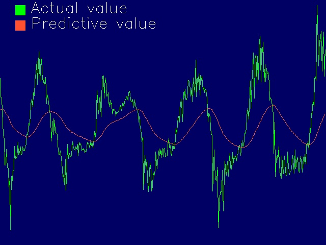
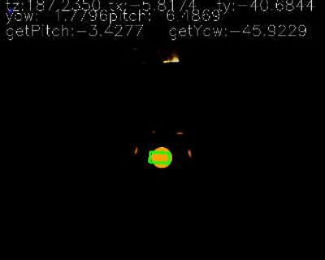
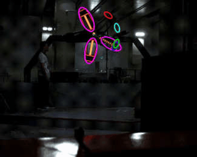
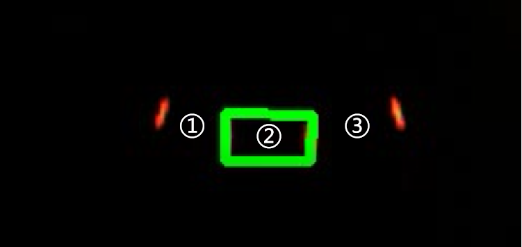
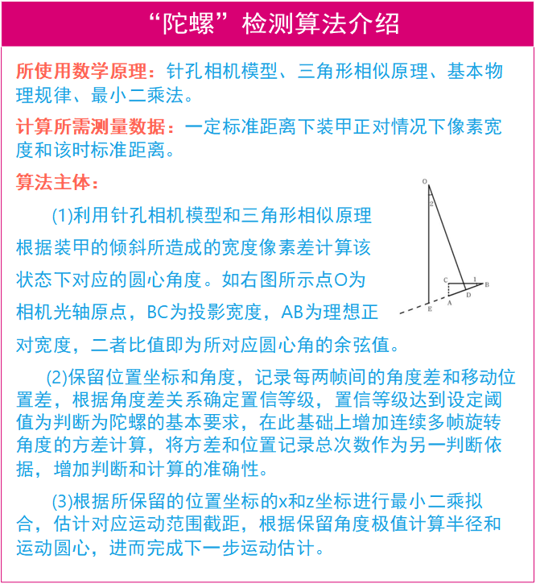
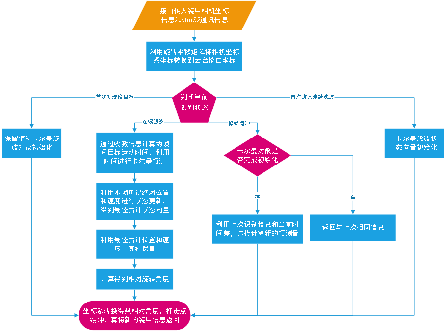
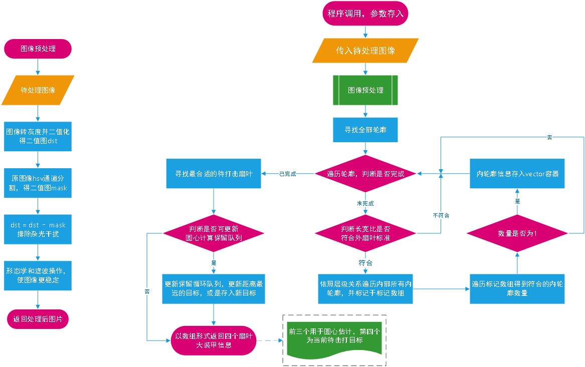
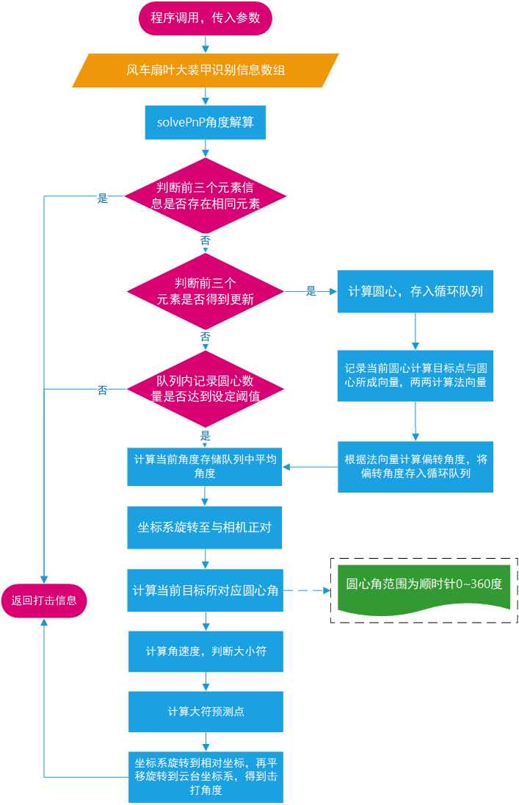

# 华北理工大学20赛季步兵视觉开源 
首先感谢北京理工大学珠海学院19赛季开源代码以及深圳大学等等许多战队和DJI官方的开源，对于本套代码的编写在思路上提供了很大的帮助，秉承开源精神，希望此套代码能为其他战队提供帮助。  
代码内部可能还存在部分问题，内部由于存在部分新旧代码以及模式切换代码冗余可能造成阅读困难深感抱歉，如有疑问欢迎联系相关技术人员讨论。  
联系方式：解佳朋 QQ:460857545 微信:xie__1024(两个下划线)  
&emsp;&emsp;&emsp;&emsp;&emsp;叶宏庆 QQ:958047328 微信:yhq38414942  
*特此声明：该软件仅可用于参加RM对抗赛或单项式的队伍之间交流讨论不可用于各种商业用途，华北理工大学Horizon战队具有最终解释权。*
<!-- TOC -->

- [华北理工大学20赛季步兵视觉开源](#华北理工大学20赛季步兵视觉开源)
  - [1.主要功能模块介绍和效果展示](#1主要功能模块介绍和效果展示)
  - [2. 依赖工具和编译环境](#2-依赖工具和编译环境)
  - [3. 编译与调试方式](#3-编译与调试方式)
  - [4. 功能模块具体实现方案](#4-功能模块具体实现方案)
    - [装甲检测：](#装甲检测)
    - [陀螺检测：](#陀螺检测)
    - [移动预测：](#移动预测)
    - [大符识别：](#大符识别)
    - [大符击打：](#大符击打)
  - [5. 整体架构](#5-整体架构)
  - [6.与stm32间通讯协议](#6与stm32间通讯协议)
  - [7. 未来展望](#7-未来展望)

<!-- /TOC -->
## 1.主要功能模块介绍和效果展示 
该代码主要分为六个部分，分别为装甲识别、角度结算、移动预测、陀螺检测、大小符的识别与击打以及相机驱动和串口通信等其他内容。以下是对于主要功能模块的介绍。  
- 装甲检测：采用大恒139套餐，采用640*512，相机可跑满，但当前对于相机的调用存在部分问题未解决，导致仅有150帧左右，大概可稳定识别4m内目标，根据本赛季视觉大概击打3m目标的战术定位来说可满足要求。  
 
- 目标移动预测：采用卡尔曼滤波器，过滤目标绝对位置坐标和x，y，z轴分别的移动速度，得到目标在每一帧绝对位置和速度的最佳估计，进而计算预测点，对于匀速目标准确度较高但同时也存在变速滞后的问题，解决方案是根据目标加速度大小控制是否打击，可在一定程度上提高命中率，我方步兵测试中对于3m处正常左右移动哨兵大概命中率在80%左右。如下图片中绿色波形为不进行卡尔曼滤波直接添加预测量的波形图，红色波形为添加卡尔曼滤波后的预测波形图。  
   
[移动打击效果演示](https://pan.baidu.com/s/1ymDKUQT3W-oz7umU6t4dgg)  （网盘提取密码：ncst）  
- 陀螺检测：当前陀螺检测成功率较高，但打击效果一般，静止哨兵击打近似一秒一圈陀螺步兵命中率大概在60%~70%间。  
    
- 大符识别与击打：打符采用单目金乾象usb相机搭配使用8mm镜头，放置于底盘，由于当前无大符实物未测试实际打击效果。  
  
## 2. 依赖工具和编译环境
- ubuntu 16.04
- QT Community 5.8.0
- opencv 3.4.2
- gcc 5.4.0
- C++11标准
- Eigen矩阵运算库
- libsvm分类器
- 大恒相机SDK
## 3. 编译与调试方式
[Eigen库的安装](https://blog.csdn.net/weixin_42587961/article/details/94011659)  
[opencv的安装](https://www.jianshu.com/p/f646448da265)  
[大恒图像官网](https://www.daheng-imaging.com/index.aspx)  
ubuntu环境下使用qt打开以pro为后缀的文件，在FindArmor\ImageProcess.cpp文件中利用宏定义的保留与注释即可更改识别模式，共分为视频、单独usb相机、单独大恒相机、  usb相机与大恒相机共同使用四种模式，内部对于如何使用已注释。在Variables.cpp文件中可以更改xml文件路径。

## 4. 功能模块具体实现方案
  ### 装甲检测：

  - 利用颜色权重进行颜色分割，灰度二值化，将灰度二值图与颜色分割图做差，去除干扰，并对最终二值图进行形态学及滤波操作。必要情况搭配滤光片辅助。
  - 寻找轮廓并进行椭圆拟合得到疑似灯条集合。
  - 灯条两两组合得到疑似装甲。
  - 装甲集合进行二次筛选去除粘连装甲，如下图所示其中序号2为正确装甲而序号1和3为错误装甲，二次筛选利用共用灯条等信息去除错误装甲,如下示意:  
   
  - 第三次筛选装甲集合，将装甲集合安装与上一帧识别装甲中心距排序，对于最近目标判断中心距是否满足一定确定阈值，满足则确认目标连续与上一帧目标相同，否则判断目标装甲号码，相同则目标连续否则切换目标。切换目标时将装甲集合按灯条高度排序，依次识别装甲号码，期间可搭配一定策略，如跳过工程机器人，当目标号码符合可击打要求时确定击打当前目标，并记录装甲号码。  

  

### 陀螺检测：
  - 利用小孔成像模型和投影关系估算目标装甲当前相对中心的偏转角度，并利用左右灯条关系确定相对于中心点的左右关系，左负右正区分左右。
  - 利用前后变化规律即角度变化和位置变化是否满足“陀螺”的运动规律，设定目标为陀螺的置信等级，并保留多次相同目标连续运动过程中的位置。
  - 利用置信等级和角度变化方差判断目标是否处于“陀螺”状态。
  - 利用最小二乘法和所保留的位置坐标计算目标陀螺运动圆心和半径用于下一步的计算。
  - 计算旋转速度结合卡尔曼滤波得到最佳估计，计算预测位置。

算法介绍:    
  
陀螺检测流程图:    
  

### 移动预测：

  - 利用与stm32通讯获得云台当前pitch轴和yaw轴的偏转角度，将相机坐标系下的相对坐标转换为相对云台初始位枪口的绝对坐标。
  - 利用帧差和程序运行过程所记录时间计算目标x，y，z轴移动速度，并放入卡尔曼滤波得到速度和位置的最佳估计。
  - 计算预测点，绝对坐标转为云台相对的偏转角度，并发送stm32。  

  
### 大符识别：

  - 灰度二值化及形态学和滤波操作，得到完整的风车二值图像。
  - 寻找全部轮廓。
  - 利用椭圆拟合和特征进行筛选找到疑似扇叶
  - 利用轮廓层级关系和内轮廓特征筛选扇叶，找到待击打扇叶。  
  

  

### 大符击打：
  - 单目测距得到相机坐标系下相对坐标，并记录。
  - 三点拟合得到空间圆心。
  - 利用圆心和圆弧上点计算风车平面相对相机平面的法向量。
  - 根据法向量计算风车平面相对相机平面的偏转角，并利用坐标系旋转变换得到正对下枪口绝对坐标，三维空间转二维计算，简化计算过程。
  - 利用卡尔曼滤波计算旋转速度结合程序运行绝对时间拟合判断大小符。
  - 计算预测点，绝对转相对，计算相对云台偏转角。  

  

## 5. 整体架构
（1）文件树：
```
InfantryVisionDetector/  
├─include                           //存放各类头文件
│ 
├─BuffDetector                      //能量机关的检测和击打
│      BuffAngleSolver.cpp          //能量机关角度解算和预测
│      FindBuff.cpp                 //能量机关检测
│        
├─Filter                            //滤波工具
│      Filter.cpp  
│        
├─FindArmor                         //装甲检测、预测、陀螺检测
│      AngleSolver.cpp              //角度解算、移动预测、陀螺击打     
│      ImageProcess.cpp             //图像获取与处理线程控制
│      LongFindArmor.cpp            //图像处理得到装甲信息
│      ShootTuoluo.cpp              //陀螺检测
│        
├─GetNum                            //数字识别
│      GetNum.cpp  
│      svm.cpp  
│        
├─SendRecive                       //与电控stm32通讯的发送和接收
│      CRC_Check.cpp               //CRC校验  
│      RemoteController.cpp        //收发线程控制
│      serial.cpp                  //收发函数构建
│        '/
├─video                            //相机接口
│       DaHengCamera.cpp           //大恒相机水星系列usb3.0接口
│       VideoCapture.cpp           //usb相机接口
│  DrawCurve.cpp                   //波形绘制
│  InfantryVisionDetector.pro     
│  InfantryVisionDetector.pro.user  
│  main.cpp                        //主函数，创造线程
│  Readme.md    
│  Variables.cpp                   //多文件共享全局变量的定义、各种宏定义、工具函数定义  
```
（2）整体思路：  
&emsp;&emsp;软件的执行开始首先创建四个线程，分别是图像生产和处理线程，与stm32数据的接收和发送线程。对于图像的生产和处理线程是通过生产者和消费者算法控制图像的异步生产和消费，提高运行速度；在接收数据线程中同步记录时间，每次在收到数据的同时将时间信息传入，在允许的误差范围内同步相机和云台；在自瞄图像处理的过程中得到装甲端点的像素坐标以及是否连续识别相同目标等基本信息，将基本信息传入角度解算函数通过pnp姿态估计得到目标在相机坐标系下的坐标，然后再根据当前目标状态（第一次发现该目标、连续识别相同目标和掉帧缓冲）执行不同的应对方案，这是该软件解决不同状态的核心思路。就移动预测方案举例，当第一次发现该目标时将各个保留值进行初始化，连续识别则连续迭代滤波计算预测量，掉帧缓冲则按上一帧位置和速度继续估算目标位置。在移动预测之前穿插陀螺检测，具体检测流程前前文流程图此处不再浪费篇幅。通过从stm32接受数据确定当前是否需要切换到击打能力机关模式。  
## 6.与stm32间通讯协议
视觉接收：  
| Byte0 | Byte1 | Byte2 | Byte3 | Byte4 | Byte5 | Byte6 |
| ------ | ------ | ------ | ------ | ------ | ------ | ------ |
|0xaa帧头|YawAngleData|YawAngleData|YawAngleData|YawAngleData|YawAngleSymbol|PitchAngleData|

|Byte7 | Byte8 | Byte9 | Byte10 | Byte11 | Byte12 | Byte13 |
| ------ | ------ | ------ | ------ | ------ | ------ | ------ |
|PitchAngleData|PitchAngleData|PitchAngleData|PitchAngleSymbol|ShootSpeedGrade|IsShootBuff|0xbb帧尾|

其中第0位和最后一位分别为帧头和帧尾，用于定位，未来会加上CRC校验。  
第1位到第4位为机器人云台当前pitch角度的数据位，利用共用体转为float数据。  
第5位为pitch轴角度标志位。  
第6位到第9位为机器人云台当前yaw角度的数据位，利用共用体转为float数据  ，0代表否，1代表是。  
第10位为yaw轴角度标志位。  
第11位为当前步兵的射速等级。  
第12位为当前是自瞄模式还是击打能量机关模式，0代表自瞄模式，1代表击打能量机关模式。

视觉发送：  
| Byte0 | Byte1 | Byte2 | Byte3 | Byte4 | Byte5 | Byte6 | Byte7 |
| ------ | ------ | ------ | ------ | ------ | ------ | ------ |------ |
|0xaa帧头|PitchAngleData|PitchAngleData|PitchAngleData|PitchAngleData|PitchAngleSymbol|YawAngleData|YawAngleData|

| Byte8 | Byte9 | Byte10 | Byte11 | Byte12 | Byte13 | Byte14 | Byte15 | 
| ------ | ------ | ------ | ------ | ------ | ------ | ------ |------ |
|YawAngleData|YawAngleData|YawAngleSymbol|IsHaveArmor|distance|IsShoot|CRC_Check|CRC_Check|

其中第0位为帧头
第1位到第4位为机器人云台当前pitch角度的数据位，利用共用体转为float数据。  
第5位为pitch轴角度标志位。  
第6位到第9位为机器人云台当前yaw角度的数据位，利用共用体转为float数据  ，0代表否，1代表是。  
第10位为yaw轴角度标志位。    
第11位为当前是否识别到目标 ，0代表否，1代表是。  
第12位为当前与目标间距离，以分米为单位，并舍弃小数。  
第13位为是否发射弹丸，0代表否，1代表是。  
第14~15位为CRC校验位。  

## 7. 未来展望
1. 优化识别算法：
   - 当前识别算法如果搭配使用滤光片存在当前场地环境灯光不足时数字识别准确度较低的情况，并且数字识别比较耗时，无法对于每一帧都识别装甲数字，当前采取的方案时利用与上一帧的中心距来辅助识别，但对于场地灯光较复杂的环境依然存在一定的误识别情况，希望来年可以在滤光片的选型以及识别算法上做出改进。
   - 当前对于灯条的拟合采用椭圆拟合，存在的问题是灯条的宽度对于拟合的高度存在较大影响，来年可能会更换为使用矩形拟合处理，或是其他算法。
   - 希望新的赛季能引用神经网络去处理图片，得到装甲信息，根本上提高程序的鲁棒性。
2. 在20赛季我队只确定了tx2使用CUDA加速的思路但是没有实际应用，来年将作出实际行动。
3. 当前移动预测算法对于变速目标跟随较慢，希望能设计出更科学有效的算法解决这一问题。
4. 提高陀螺打击的准确度，希望新的赛季能做出更大的突破。
5. 在调节定点打击目标时需要调节相机相对云台的偏移量，当前主要调节参数为三个轴（pitch、yaw、roll、）的偏移和三个坐标系（x、y、z）的偏移，调节方法可能存在一定问题，十分繁琐，希望能找到一个更行之有效的方法解决这一问题。
6. 当前滤波的波形显示使用的是opencv的polylines绘制圆滑折线，没有做上位机的参数调节，导致调节卡尔曼参数的时候很繁琐，希望新的赛季能设计出更便于调节的上位机。
